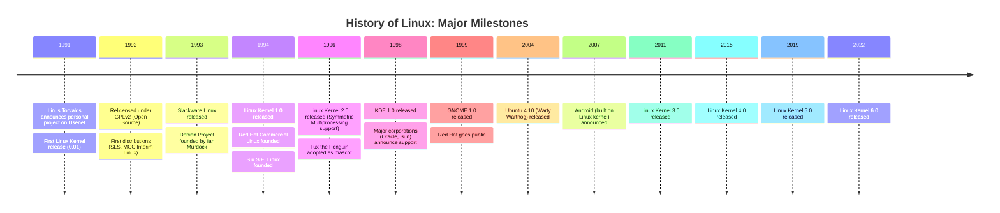

> [!Note]
> In 1984 Richard Stallman, an American software engineer, had a goal to create a completely free UNIX-compatible open-source (non-proprietary) operating system. The initiative was called the GNU Project (GNU’s Not Unix) and by 1991.
> Then Linus Torvalds developed a kernel and proclaimed it's availability.

- Basically `Linux` is not an OS, it's a open-source kernel.
- Here's a basic diagram that will give a brief idea about the evolution of `linux`:

- There are several distros available which uses the linux kernel as their base and it's a picture i found on the web that demonstrates the evolution of distros pretty well[_CURRENTLY THE PROJECT IS NOT MAINTAINED ANYMORE_] -> [DISTRO-EVOLUTION](https://upload.wikimedia.org/wikipedia/commons/1/1b/Linux_Distribution_Timeline.svg) 

